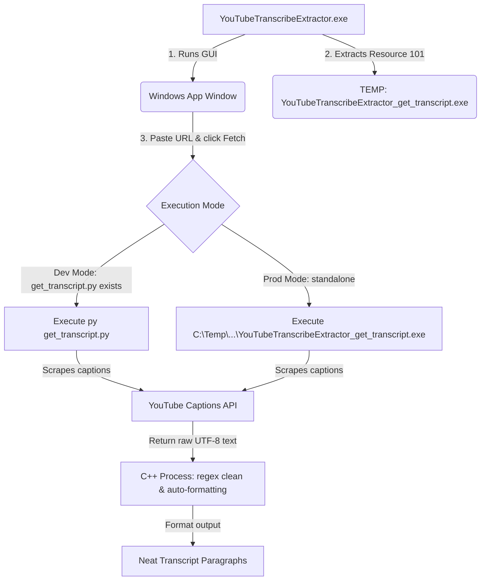

# 🎥 YouTube Transcript Extractor & Cleaner

[](https://www.microsoft.com)
[](https://en.cppreference.com/w/cpp/20)
[](https://www.python.org)
[](https://cmake.org)
[](LICENSE)

A high-performance, modern Windows desktop application to retrieve, clean, and format YouTube video transcripts. It strips timestamps, collapses annotations, resolves spacing, and formats transcripts into readable paragraphs—all packaged in a **zero-dependency, single-file executable**.

---

## ✨ Key Features

| Feature | Description |
| :--- | :--- |
| **🚀 Auto-Extraction** | Simply paste any YouTube URL or Video ID to fetch the transcript instantly. |
| **🇩🇪 Unicode/Umlaut Support** | Flawless handling of German characters (`ä`, `ö`, `ü`, `ß`) and international symbols. |
| **🧠 Smart Paragraphing** | Automatically inserts paragraph breaks where speaker pauses exceed 10 seconds. |
| **📄 PDF & TXT Export** | Export fully wrapped transcripts straight to `.txt` files or formatted `.pdf` documents. |
| **🔋 Self-Contained Execution** | PyInstaller-compiled transcription scripts are embedded directly inside the C++ binary. |

---

## 🛠 How It Works

The application operates as a hybrid C++ GUI and Python scraping backend. To make execution seamless, the C++ binary extracts and handles the Python backend dynamically at runtime:



---

## 📦 How to Install & Run

No installations, no Python downloads, and no terminal configurations needed for end-users:

1. Head over to the **[Releases](https://github.com/username/YouTubeTranscribeExtractor/releases)** page.
2. Download the `YouTubeTranscribeExtractor.exe` executable.
3. Double-click the file to launch the program!

---

## 💻 Developer Guide

If you'd like to clone the repository and make further edits, follow this workflow:

### Workspace Pre-requisites
1. **CLion IDE** or **MinGW Compiler**
2. **Python 3.10+** (Added to your system PATH)
3. Python libraries:
   ```cmd
   pip install youtube-transcript-api pyinstaller
   ```

### Local Development Cycle
- **Edit Scraper Logic**: Edit `get_transcript.py`. When you run the C++ app in debug mode from CLion, it detects this script locally in the source tree and uses it directly.
- **Package the Helper**: Once your Python changes are complete, bundle it back into the binary resource directory:
  ```cmd
  py -m PyInstaller --onefile get_transcript.py
  ```
- **Edit GUI & Build**: Make modifications to `main.cpp` and compile using CLion's **Release** configuration.

---

## 📜 License
This project is licensed under the MIT License - see the LICENSE file for details.
