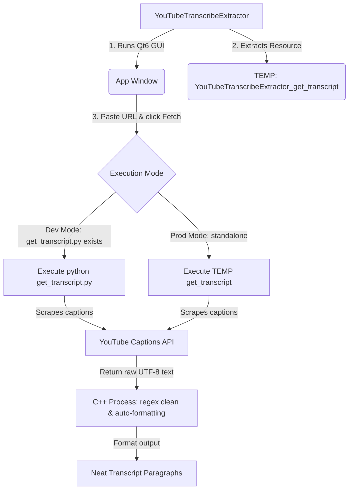

# 🎥 YouTube Transcript Extractor & Cleaner

[](https://github.com/username/YouTubeTranscribeExtractor)
[](https://en.cppreference.com/w/cpp/20)
[](https://www.qt.io)
[](https://www.python.org)
[](https://cmake.org)
[](LICENSE)

A high-performance, modern cross-platform desktop application to retrieve, clean, and format YouTube video transcripts. It strips timestamps, collapses annotations, resolves spacing, and formats transcripts into readable paragraphs—all packaged in a **zero-dependency, standalone application** using Qt6.

---

## 📦 How to Install & Run

1. Head over to the **[Releases](https://github.com/username/YouTubeTranscribeExtractor/releases)** page.
2. Download the package for your operating system:
   * **Windows:** Download `YouTubeTranscribeExtractor-Windows.exe` and run it directly.
   * **macOS:** Download `YouTubeTranscribeExtractor-macOS.dmg`, double-click to mount, and drag the app to your `Applications` folder.
   * **Linux:** Download `YouTubeTranscribeExtractor-Linux.tar.gz`, extract, and run `YouTubeTranscribeExtractor`.

---


---

## ✨ Key Features

| Feature | Description |
| :--- | :--- |
| **🚀 Auto-Extraction** | Simply paste any YouTube URL or Video ID to fetch the transcript instantly. |
| **🇩🇪 Unicode/Umlaut Support** | Flawless handling of German characters (`ä`, `ö`, `ü`, `ß`) and international symbols. |
| **🧠 Smart Paragraphing** | Automatically inserts paragraph breaks where speaker pauses exceed 10 seconds. |
| **📄 PDF & TXT Export** | Export fully wrapped transcripts straight to `.txt` files or formatted `.pdf` documents via Qt's native layout engine. |
| **🔌 Cross-Platform Standalone** | Compiles to native executables on Windows (`.exe`), macOS (`.app` / `.dmg`), and Linux (`.tar.gz`). |

---

## 🛠 How It Works

The application operates as a hybrid C++ Qt GUI and Python scraping backend. The Qt application extracts and runs the Python helper binary dynamically at runtime:



---

## 💻 Developer Guide

If you'd like to clone the repository and make further edits, follow this workflow:

### Workspace Pre-requisites
1. **CLion IDE** or **CMake**
2. **Qt6 SDK** installed (Make sure CMake can locate the library using `-DCMAKE_PREFIX_PATH=<path_to_qt>`)
3. **Python 3.10+** (Added to your system PATH)
4. Python libraries:
   ```cmd
   pip install youtube-transcript-api pyinstaller
   ```

### Local Development Cycle
* **Edit Scraper Logic**: Edit `get_transcript.py`. When you run the C++ app in debug mode, it detects this script locally and executes it using your Python interpreter.
* **Package the Helper**: Once your Python changes are complete, bundle it before compiling the C++ target:
  ```cmd
  # Windows
  py -m PyInstaller --onefile get_transcript.py
  
  # macOS/Linux
  pyinstaller --onefile get_transcript.py
  ```
* **Edit GUI & Build**: Make modifications to `main.cpp` and compile using CMake.

---

## 📜 License
This project is licensed under the MIT License - see the [LICENSE](file:///c:/Users/joshu/CLionProjects/YouTubeTranscribeExtractor/LICENSE) file for details.
